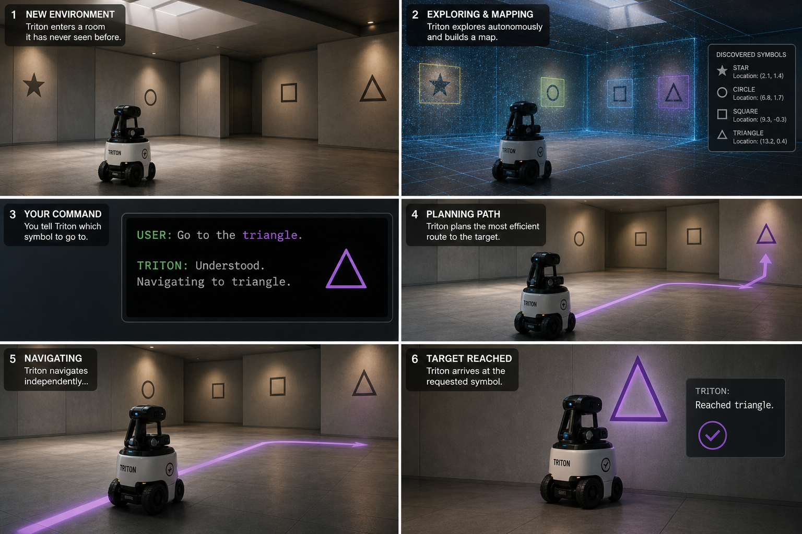
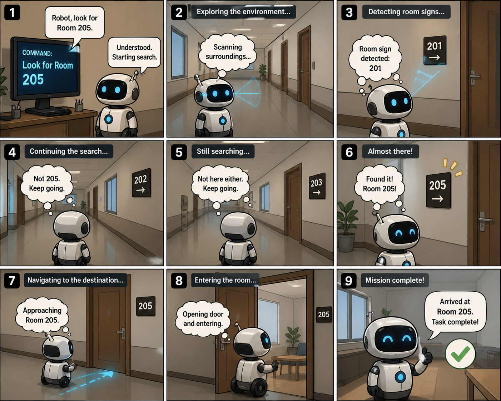
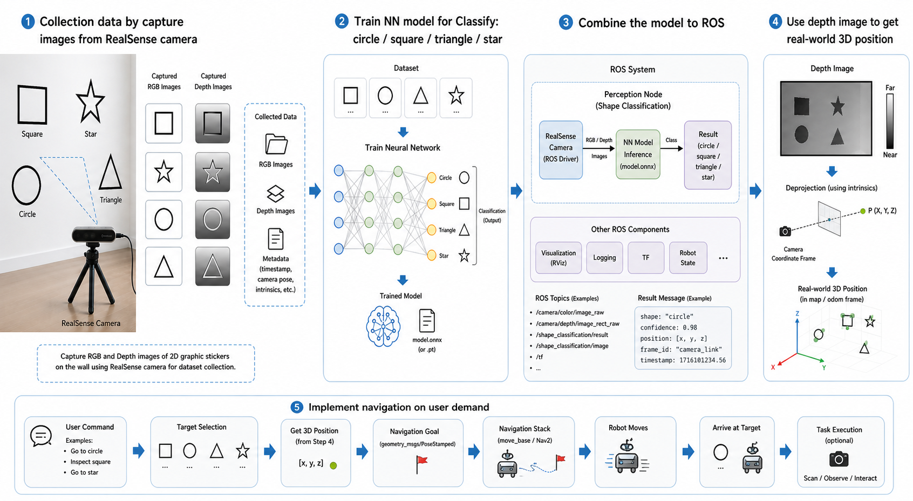
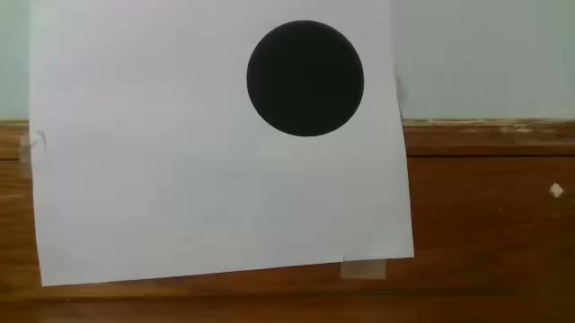
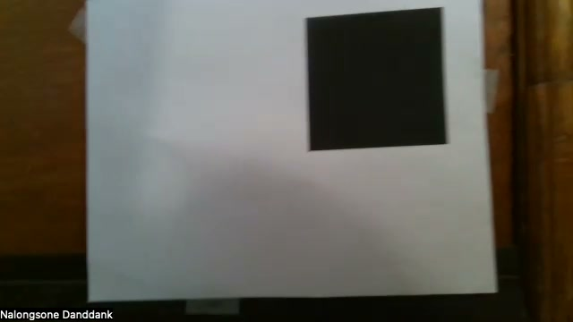
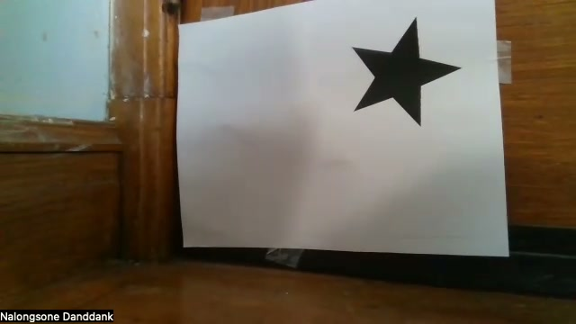
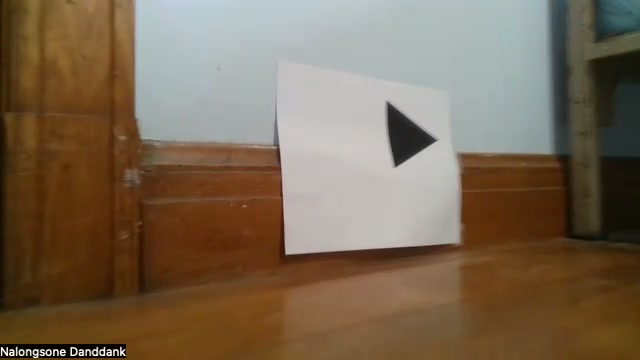

# Final Project Group 3 (Additional Experiment): Triton Robot Symbol Search and Recognition

From UMass COMPSCI 603 Robotics.

By Nalongsone Danddank

Email: ndanddank@umass.edu

Github: [https://github.com/ping58972/robotic603_finalproject](https://github.com/ping58972/robotic603_finalproject)

## Introduction

This project builds an autonomous symbol-search system for the Triton mobile robot. The robot uses ROS Noetic, a camera stream, LiDAR scan data, and trained neural-network classifiers to search for printed geometric symbols: `circle`, `square`, `star`, and `triangle`.

The goal is to let a user request a target symbol, start the robot, classify symbols from the live camera image, and drive toward the requested target while using LiDAR to stop before contact. The current implementation focuses on a real-robot ROS package named `symbols_recognition`, plus a PyTorch training workspace for the image classifiers used by that package.

Concept reference images:

| Autonomous symbol search                                                                      | Room-search concept                                                          |
| --------------------------------------------------------------------------------------------- | ---------------------------------------------------------------------------- |
|  |  |

System concept:



At a high level, the pipeline is:

1. Capture RGB images of printed symbols from the robot camera.
2. Train a symbol classifier with the collected dataset.
3. Load the trained PyTorch checkpoint inside a ROS node.
4. Publish classification results and an optional annotated image topic.
5. Use a target-seeking controller to rotate, align, approach, and stop at the requested symbol.

## Repository Layout

```text
.
|-- Dockerfile
|-- docker-compose.yaml
|-- setup.bash
|-- catkin_ws/
|   `-- src/
|       `-- symbols_recognition/
|-- nn_training/
|   |-- cnn/
|   |-- mobilenetv2/
|   `-- datasets/
`-- others/
    |-- reference-images/
    `-- report-paper/
```

## Training Neural Network Models

The training code is in `nn_training/`. It contains two PyTorch model folders:

- `nn_training/cnn/`: a custom convolutional neural network using 128x128 input images.
- `nn_training/mobilenetv2/`: a MobileNetV2 classifier using 224x224 input images.

Both models train on the same dataset layout:

```text
nn_training/datasets/
|-- trainset/
|   |-- circles/
|   |-- squares/
|   |-- stars/
|   `-- triangles/
|-- validset/
|   |-- circles/
|   |-- squares/
|   |-- stars/
|   `-- triangles/
`-- testset/
    |-- circles/
    |-- squares/
    |-- stars/
    `-- triangles/
```

Sample training images:

| Circle                                                                        | Square                                                                        | Star                                                                      | Triangle                                                                          |
| ----------------------------------------------------------------------------- | ----------------------------------------------------------------------------- | ------------------------------------------------------------------------- | --------------------------------------------------------------------------------- |
|  |  |  |  |

Saved dataset counts:

| Split        | Circle | Square | Star | Triangle | Total |
| ------------ | -----: | -----: | ---: | -------: | ----: |
| `trainset` |   1246 |    527 |  644 |      682 |  3099 |
| `validset` |    203 |     86 |  105 |      110 |   504 |
| `testset`  |    213 |     90 |  110 |      117 |   530 |

### 1. Create the Python Environment

From the repository root:

```bash
cd nn_training
python3 -m venv .venv
source .venv/bin/activate
python3 -m pip install --upgrade pip
```

Install dependencies for the model you want to train:

```bash
python3 -m pip install -r cnn/requirements.txt
python3 -m pip install -r mobilenetv2/requirements.txt
```

Both requirements files install `torch`, `torchvision`, `pillow`, and `matplotlib`.

### 2. Train the CNN Model

Run from the `nn_training/` folder:

```bash
python3 -m cnn.train --epochs 40 --batch-size 64 --image-size 128 --device auto
```

Useful device options:

```bash
python3 -m cnn.train --device cpu
python3 -m cnn.train --device mps
python3 -m cnn.train --device cuda
```

Training outputs:

```text
nn_training/cnn/checkpoints/symbols_cnn_best.pt
nn_training/cnn/checkpoints/symbols_cnn_latest.pt
nn_training/cnn/runs/symbols_cnn/history.csv
nn_training/cnn/runs/symbols_cnn/dataset_counts.json
nn_training/cnn/runs/symbols_cnn/test_metrics.json
```

Evaluate the trained checkpoint:

```bash
python3 -m cnn.evaluate --checkpoint cnn/checkpoints/symbols_cnn_best.pt --split testset
python3 -m cnn.evaluate --checkpoint cnn/checkpoints/symbols_cnn_best.pt --split validset
```

Generate the result graph:

```bash
python3 -m cnn.plot_results
```

Saved CNN result:


The saved CNN run reports `test_accuracy = 1.0` and `test_loss = 2.913e-05` in `nn_training/cnn/runs/symbols_cnn/test_metrics.json`.

### 3. Train the MobileNetV2 Model

Run from the `nn_training/` folder:

```bash
python3 -m mobilenetv2.train --epochs 40 --batch-size 32 --image-size 224 --device auto
```

Optional pretrained ImageNet initialization:

```bash
python3 -m mobilenetv2.train --pretrained
python3 -m mobilenetv2.train --pretrained --freeze-features
```

If `--pretrained` is used and the weights are not already cached, `torchvision` needs network access to download the weights.

Training outputs:

```text
nn_training/mobilenetv2/checkpoints/symbols_mobilenetv2_best.pt
nn_training/mobilenetv2/checkpoints/symbols_mobilenetv2_latest.pt
nn_training/mobilenetv2/runs/symbols_mobilenetv2/history.csv
nn_training/mobilenetv2/runs/symbols_mobilenetv2/dataset_counts.json
nn_training/mobilenetv2/runs/symbols_mobilenetv2/test_metrics.json
```

Evaluate the trained checkpoint:

```bash
python3 -m mobilenetv2.evaluate --checkpoint mobilenetv2/checkpoints/symbols_mobilenetv2_best.pt --split testset
python3 -m mobilenetv2.evaluate --checkpoint mobilenetv2/checkpoints/symbols_mobilenetv2_best.pt --split validset
```

Generate the result graph:

```bash
python3 -m mobilenetv2.plot_results
```

Saved MobileNetV2 result:


The saved MobileNetV2 run reports `test_accuracy = 0.9981` and `test_loss = 0.00295` in `nn_training/mobilenetv2/runs/symbols_mobilenetv2/test_metrics.json`.

### 4. Predict a Single Image

CNN:

```bash
python3 -m cnn.predict \
  --checkpoint cnn/checkpoints/symbols_cnn_best.pt \
  --image datasets/testset/triangles/frame_03201.jpg
```

MobileNetV2:

```bash
python3 -m mobilenetv2.predict \
  --checkpoint mobilenetv2/checkpoints/symbols_mobilenetv2_best.pt \
  --image datasets/testset/triangles/frame_03201.jpg
```

Predict all images in a folder:

```bash
python3 -m cnn.predict \
  --checkpoint cnn/checkpoints/symbols_cnn_best.pt \
  --image-dir datasets/testset/stars
```

## Docker

The Docker setup builds an Ubuntu 20.04 ROS Noetic environment with the ROS desktop stack, RealSense and USB camera packages, RPLIDAR support, `cv_bridge`, OpenCV, PyTorch CPU wheels, and the catkin workspace.

Important Docker files:

- `Dockerfile`: installs ROS Noetic, Python dependencies, PyTorch, copies `catkin_ws/src`, and runs `catkin build`.
- `docker-compose.yaml`: builds image `triton_noetic_ping:latest`, mounts local source code into `/catkin_ws/src`, mounts `nn_training` read-only into `/nn_training`, uses host networking, and passes camera/device access through `/dev`.
- `setup.bash`: sources ROS and the catkin workspace, asks for a target symbol if one was not provided, then launches `symbols_recognition real_robot.launch`.

### 1. Set ROS Network Variables

When ROS nodes communicate across the robot and host, `ROS_IP` must be the IP address reachable by the other ROS machines.

For a self-contained run where `roscore` and nodes are inside the same container:

```bash
export ROS_MASTER_URI=http://localhost:11311
export ROS_IP=127.0.0.1
```

For a real robot network, replace the IP values with the robot or host IP used on the robot network. The compose file defaults to `ROS_IP=10.0.0.20`, so override it if your machine uses a different address:

```bash
export ROS_MASTER_URI=http://10.0.0.20:11311
export ROS_IP=10.0.0.20
```

If you need GUI tools such as RViz from inside the container on a Linux host:

```bash
xhost +local:docker
export DISPLAY=${DISPLAY}
```

### 2. Build the Docker Image

From the repository root:

```bash
docker compose build
```

Or build only this service:

```bash
docker compose build triton_noetic_ping
```

### 3. Start the Container

```bash
docker compose up -d
```

Check that it is running:

```bash
docker compose ps
```

Open a shell inside the container:

```bash
docker compose exec triton_noetic_ping bash
```

Inside the container, source ROS and the workspace:

```bash
source /opt/ros/noetic/setup.bash
source /catkin_ws/devel/setup.bash
```

If you changed ROS source files after the image was built, rebuild the catkin workspace because `./catkin_ws/src` is mounted into the container:

```bash
cd /catkin_ws
catkin build
source /catkin_ws/devel/setup.bash
```

### 4. Run the ROS Package from Docker

Interactive target prompt:

```bash
docker compose exec triton_noetic_ping /setup.bash
```

Direct target symbol:

```bash
docker compose exec triton_noetic_ping /setup.bash target_symbol:=triangle
```

Manual launch from inside the container:

```bash
source /opt/ros/noetic/setup.bash
source /catkin_ws/devel/setup.bash
roslaunch symbols_recognition real_robot.launch target_symbol:=triangle
```

Use MobileNetV2 instead of the default CNN checkpoint:

```bash
roslaunch symbols_recognition real_robot.launch \
  target_symbol:=triangle \
  model_type:=mobilenetv2 \
  checkpoint_path:=/nn_training/mobilenetv2/checkpoints/symbols_mobilenetv2_best.pt
```

Stop and remove the running container:

```bash
docker compose down
```

Note: `real_robot.launch` includes the Triton bringup launch from a package named `stingray_camera` when `bringup:=true`. If that package is not present in `catkin_ws/src` or is launched separately on the robot, start this package with `bringup:=false`.

```bash
roslaunch symbols_recognition real_robot.launch \
  bringup:=false \
  target_symbol:=triangle
```

## `symbols_recognition` ROS Package

The ROS package is located at:

```text
catkin_ws/src/symbols_recognition/
```

Package structure:

```text
symbols_recognition/
|-- CMakeLists.txt
|-- package.xml
|-- launch/
|   |-- real_robot.launch
|   `-- wall_following.launch
|-- scripts/
|   |-- symbol_classifier.py
|   |-- target_symbol_controller.py
|   |-- real_wall_follower.py
|   |-- P2D1_wallFollower.py
|   `-- position_publisher.py
|-- models/
|   `-- triton/
|-- plugins/
|   `-- model_push.cc
|-- rviz/
|   `-- lidar.rviz
`-- worlds/
    `-- largemaze.world
```

### Main Nodes

`symbol_classifier.py` subscribes to a camera image topic, loads a trained PyTorch checkpoint, predicts one of `circle`, `square`, `star`, or `triangle`, optionally estimates a 2-D bounding box, and publishes classification outputs.

Default input:

```text
/camera/color/image_raw
```

Published outputs:

```text
/symbol_classifier/label
/symbol_classifier/confidence
/symbol_classifier/result
/symbol_classifier/annotated_image
```

The JSON result includes the accepted label, raw label, confidence, model type, checkpoint path, image size, normalized symbol center, optional bounding box, timestamp, and per-class probabilities.

`target_symbol_controller.py` receives `/symbol_classifier/result` and `/scan`. It searches by rotating in place, aligns the detected target to the center of the camera image, drives forward while the target stays visible, and stops when the front LiDAR sector is within `stop_distance`.

Default command output:

```text
/cmd_vel
```

`real_wall_follower.py` is an optional LiDAR wall follower for the real robot. It reads `/scan` and publishes `/cmd_vel`.

`wall_following.launch`, `position_publisher.py`, and `P2D1_wallFollower.py` support the Gazebo wall-following simulation using `worlds/largemaze.world`, the Triton model, RViz, and Gazebo model-state services.

### Real-Robot Launch

Default real-robot launch:

```bash
roslaunch symbols_recognition real_robot.launch target_symbol:=star
```

Common launch arguments:

| Argument                  | Default                                              | Meaning                                                                 |
| ------------------------- | ---------------------------------------------------- | ----------------------------------------------------------------------- |
| `target_symbol`         | `prompt`                                           | Target to search for:`star`, `square`, `circle`, or `triangle`. |
| `bringup`               | `true`                                             | Include Triton hardware bringup from `stingray_camera`.               |
| `use_usb_cam`           | `true`                                             | Use `usb_cam` for the color camera.                                   |
| `usb_video_device`      | `/dev/video2`                                      | Video device for the RGB stream.                                        |
| `usb_pixel_format`      | `yuyv`                                             | Camera pixel format.                                                    |
| `image_topic`           | `/camera/color/image_raw`                          | Image topic consumed by the classifier.                                 |
| `checkpoint_path`       | `/nn_training/cnn/checkpoints/symbols_cnn_best.pt` | PyTorch checkpoint loaded by the classifier.                            |
| `model_type`            | `auto`                                             | `auto`, `cnn`, or `mobilenetv2`.                                  |
| `target_seek`           | `true`                                             | Start the target-seeking controller.                                    |
| `wall_follow`           | `false`                                            | Start the optional real wall follower.                                  |
| `stop_distance`         | `0.65`                                             | LiDAR stop distance in meters.                                          |
| `target_min_confidence` | `0.75`                                             | Minimum classifier confidence accepted by the controller.               |

Run only the classifier and publish results:

```bash
roslaunch symbols_recognition real_robot.launch \
  bringup:=false \
  target_seek:=false \
  target_symbol:=triangle
```

Run classifier and target controller with tuning:

```bash
roslaunch symbols_recognition real_robot.launch \
  target_symbol:=circle \
  target_min_confidence:=0.80 \
  require_bbox:=true \
  require_classifier_ready:=true \
  classifier_timeout:=2.0 \
  stop_distance:=0.60 \
  approach_speed:=0.14 \
  search_angular_speed:=0.30
```

Use the USB camera explicitly:

```bash
roslaunch symbols_recognition real_robot.launch \
  target_symbol:=circle \
  use_usb_cam:=true \
  usb_video_device:=/dev/video2 \
  usb_pixel_format:=yuyv \
  color_width:=640 \
  color_height:=480 \
  color_fps:=15
```

If the USB camera stream is green, purple, warped, or using the wrong endpoint, inspect available camera devices:

```bash
v4l2-ctl --list-devices
v4l2-ctl --list-formats-ext -d /dev/video2
```

On many RealSense setups the RGB stream is `/dev/video2`, but the index can change. Use the video device and pixel format that actually expose the color stream.

### Simulation Launch

The package also includes a Gazebo wall-following launch:

```bash
roslaunch symbols_recognition wall_following.launch
```

This starts Gazebo with `worlds/largemaze.world`, spawns the Triton model, publishes odometry from Gazebo model state, starts the simple wall follower, and opens RViz with `rviz/lidar.rviz`.

### Debugging Commands

Check ROS topics:

```bash
rostopic list
rostopic echo /symbol_classifier/result
rostopic echo /symbol_classifier/confidence
```

Check that the classifier node is alive:

```bash
rosnode list | grep symbol_classifier
```

Run the classifier directly:

```bash
rosrun symbols_recognition symbol_classifier.py \
  _checkpoint_path:=/nn_training/cnn/checkpoints/symbols_cnn_best.pt \
  _image_topic:=/camera/color/image_raw
```

View the annotated classifier stream through `web_video_server` when it is enabled:

```text
http://<robot-ip>:8080/stream?topic=/symbol_classifier/annotated_image
```

## Notes

- The Docker compose service uses `network_mode: host`, `privileged: true`, and `/dev:/dev` because ROS robot hardware nodes need direct network and device access.
- The trained checkpoints are mounted in Docker at `/nn_training`, matching the default ROS launch paths.
- The default Docker command keeps the container alive with `tail -f /dev/null`; start ROS manually with `/setup.bash` or `roslaunch`.
- If the classifier result topic exists but the classifier node is not listed by `rosnode list`, the topic may only exist because another node subscribes to it. Start `symbol_classifier.py` directly to see the real Python or checkpoint-loading error.

## Result Record Video

[](https://www.youtube.com/watch?v=vd26c0NDQ-E)

Watch the result record video: [https://www.youtube.com/watch?v=vd26c0NDQ-E](https://www.youtube.com/watch?v=vd26c0NDQ-E)

This video records the final project result for the Triton robot symbol-search system. It demonstrates the robot running the ROS pipeline, using the camera stream to observe printed geometric symbols, applying the trained recognition model, and connecting perception output to robot behavior. The video is the practical demonstration of the workflow described in this README: dataset collection, model training, ROS package integration, Docker-based runtime setup, and real-robot symbol recognition.
